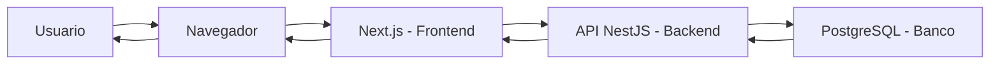
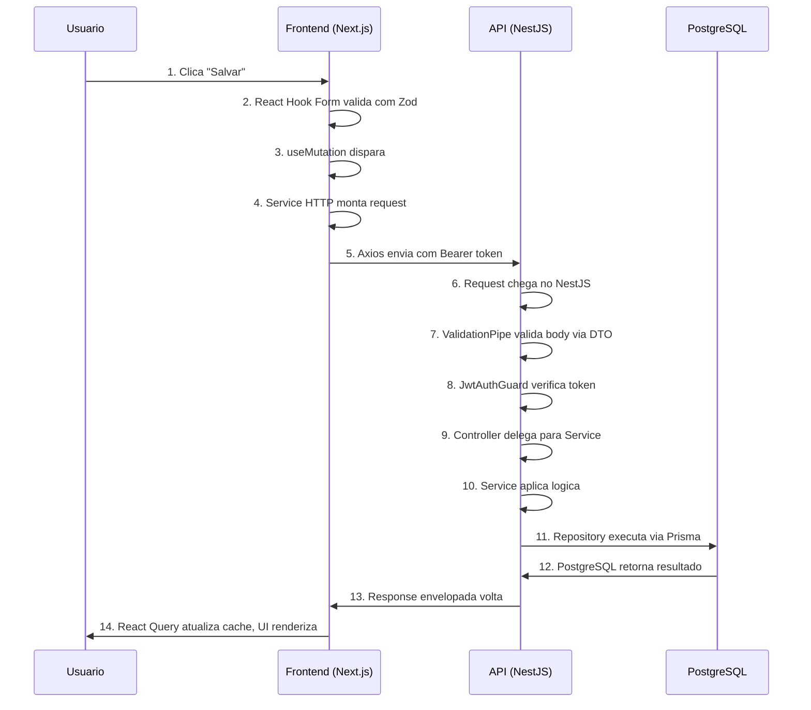

# 02 — Como Tudo se Conecta

Antes de mexer em qualquer codigo, entenda como as pecas se encaixam. Este documento e o seu mapa.

---

## 2.1 — Visao de Helicoptero



| Seta | O que acontece |
|------|---------------|
| Usuario -> Navegador | O usuario acessa a URL do sistema |
| Navegador -> Next.js | O navegador carrega a aplicacao React/Next.js |
| Next.js -> API NestJS | O frontend faz requests HTTP para a API |
| API NestJS -> PostgreSQL | O backend consulta/grava dados no banco |
| PostgreSQL -> Usuario | Os dados fazem o caminho de volta ate a tela |

**Resumo:** O usuario interage com o **Next.js** (frontend), que se comunica com o **NestJS** (backend) via API REST, que por sua vez persiste e busca dados no **PostgreSQL** usando o **Prisma** como ORM.

---

## 2.2 — Anatomia de uma Request (do clique ao banco e de volta)

Vamos seguir uma request real: o usuario clica "Salvar" num formulario de produto.



### Passo a passo detalhado

| # | O que acontece | Arquivo no projeto |
|---|---------------|-------------------|
| 1 | Usuario clica "Salvar" no formulario | `features/products/components/product-form.tsx` |
| 2 | React Hook Form valida os campos usando schema Zod | `features/products/schemas/product.schema.ts` |
| 3 | `useMutation` do React Query e disparado | `features/products/hooks/use-create-product.ts` |
| 4 | Service HTTP monta o request com os dados | `features/products/services/product.service.ts` |
| 5 | Axios interceptor injeta o Bearer token no header | `lib/api.ts` |
| 6 | Request chega no NestJS e entra no pipeline | `src/main.ts` (configuracao global) |
| 7 | `ValidationPipe` valida o body contra o DTO | `src/modules/products/dto/create-product.dto.ts` |
| 8 | `JwtAuthGuard` verifica se o token JWT e valido | `src/common/guards/jwt-auth.guard.ts` |
| 9 | Controller recebe e delega para o Service | `src/modules/products/products.controller.ts` |
| 10 | Service aplica regras de negocio e chama Repository | `src/modules/products/products.service.ts` |
| 11 | Repository executa a query via Prisma Client | `src/modules/products/products.repository.ts` |
| 12 | Prisma converte para SQL e o PostgreSQL executa | `prisma/schema.prisma` (define a estrutura) |
| 13 | Response sobe: Repo -> Service -> Controller -> Interceptor envelopa em `{ data, meta }` | `src/common/interceptors/response.interceptor.ts` |
| 14 | React Query recebe, atualiza o cache, e o React re-renderiza a UI | `features/products/hooks/use-products.ts` |

---

## 2.3 — Repositorios: como organizar

A Bravy usa **repositorios separados** para frontend e backend:

```
bravy-{projeto}-api    # Backend NestJS
bravy-{projeto}-web    # Frontend Next.js
```

**Exemplos:**
- `bravy-marketplace-api` + `bravy-marketplace-web`
- `bravy-dashboard-api` + `bravy-dashboard-web`

**Por que separar?**
- Deploy independente (atualizar frontend sem re-deploy do backend)
- Times podem trabalhar em paralelo
- Ciclos de release diferentes
- Escalar frontend e backend de forma independente

**Como se comunicam?**
- Via **API REST** (HTTP requests)
- Frontend nunca acessa o banco diretamente
- Toda comunicacao passa pela API

---

## 2.4 — Ambientes

| Ambiente | URL | Banco | Docker | Proposito |
|----------|-----|-------|--------|-----------|
| **Local** | `http://localhost:3000` (web) / `http://localhost:3001` (api) | PostgreSQL local via Docker | `docker-compose.yml` | Desenvolvimento diario |
| **Staging** | `https://staging.bravy.com.br` | PostgreSQL staging (isolado) | Docker em servidor de staging | Testes antes de ir pra producao |
| **Producao** | `https://app.bravy.com.br` | PostgreSQL producao (backup diario) | Docker + nginx + SSL | Usuarios finais |

**Regras:**
- Nunca teste em producao
- Staging deve ser o mais proximo possivel de producao
- Variaveis de ambiente (`.env`) sao diferentes em cada ambiente
- Dados de staging podem ser resetados a qualquer momento

---

## 2.5 — Diagrama de Pastas Lado a Lado

```
BACKEND (NestJS)                          FRONTEND (Next.js)
bravy-{projeto}-api/                      bravy-{projeto}-web/
├── prisma/                               ├── public/
│   ├── schema.prisma        <──────────> │   └── ...
│   ├── migrations/                       ├── src/
│   └── seed.ts                           │   ├── app/
├── src/                                  │   │   ├── (auth)/
│   ├── main.ts                           │   │   │   ├── login/page.tsx
│   ├── app.module.ts                     │   │   │   └── register/page.tsx
│   ├── common/                           │   │   ├── (dashboard)/
│   │   ├── decorators/                   │   │   │   ├── layout.tsx
│   │   ├── filters/                      │   │   │   ├── products/
│   │   │   └── http-exception.filter.ts  │   │   │   │   ├── page.tsx
│   │   ├── guards/                       │   │   │   │   └── new/page.tsx
│   │   │   ├── jwt-auth.guard.ts         │   │   │   ├── users/
│   │   │   └── roles.guard.ts            │   │   │   └── settings/
│   │   ├── interceptors/                 │   │   ├── layout.tsx
│   │   │   └── response.interceptor.ts   │   │   └── globals.css
│   │   ├── pipes/                        │   ├── components/
│   │   └── types/                        │   │   ├── layout/
│   ├── config/                           │   │   │   ├── sidebar.tsx
│   │   └── env.config.ts                 │   │   │   ├── header.tsx
│   ├── database/                         │   │   │   └── main-layout.tsx
│   │   ├── prisma.module.ts              │   │   ├── shared/
│   │   ├── prisma.service.ts             │   │   │   ├── data-table.tsx
│   │   └── repositories/                 │   │   │   ├── confirm-dialog.tsx
│   │       └── base.repository.ts        │   │   │   └── loading-spinner.tsx
│   └── modules/                          │   │   └── ui/  (shadcn)
│       ├── auth/                         │   │       ├── button.tsx
│       │   ├── auth.module.ts            │   │       ├── input.tsx
│       │   ├── auth.controller.ts        │   │       └── ...
│       │   ├── auth.service.ts           │   ├── features/
│       │   ├── strategies/               │   │   └── products/
│       │   │   ├── jwt.strategy.ts       │   │       ├── components/
│       │   │   └── jwt-refresh.strategy  │   │       │   ├── product-form.tsx
│       │   ├── guards/                   │   │       │   ├── product-table.tsx
│       │   ├── decorators/               │   │       │   └── product-columns.tsx
│       │   └── dto/                      │   │       ├── hooks/
│       ├── users/                        │   │       │   ├── use-products.ts
│       │   ├── users.module.ts           │   │       │   └── use-create-product.ts
│       │   ├── users.controller.ts       │   │       ├── services/
│       │   ├── users.service.ts          │   │       │   └── product.service.ts
│       │   ├── users.repository.ts       │   │       ├── schemas/
│       │   └── dto/                      │   │       │   └── product.schema.ts
│       └── products/                     │   │       └── types/
│           ├── products.module.ts        │   │           └── product.types.ts
│           ├── products.controller.ts    │   ├── hooks/
│           ├── products.service.ts       │   ├── lib/
│           ├── products.repository.ts    │   │   ├── api.ts
│           └── dto/                      │   │   ├── utils.ts
│               ├── create-product.dto.ts │   │   └── cn.ts
│               ├── update-product.dto.ts │   ├── providers/
│               └── product-response.dto  │   │   ├── auth-provider.tsx
├── test/                                 │   │   └── query-provider.tsx
│   └── app.e2e-spec.ts                  │   ├── stores/
├── .env                                  │   └── types/
├── .env.example                          ├── .env.local
├── docker-compose.yml                    ├── .env.example
├── Dockerfile                            ├── Dockerfile
├── nest-cli.json                         ├── next.config.js
├── package.json                          ├── tailwind.config.ts
└── tsconfig.json                         ├── package.json
                                          └── tsconfig.json
```

### Conexoes entre backend e frontend

| Backend | Frontend | Relacao |
|---------|----------|---------|
| `dto/create-product.dto.ts` | `types/product.types.ts` | O DTO define a estrutura; o Type replica no frontend |
| `products.controller.ts` (endpoints) | `services/product.service.ts` (HTTP calls) | O frontend chama os endpoints definidos no controller |
| `response.interceptor.ts` (envelope) | `lib/api.ts` (parser) | O frontend sabe o formato `{ data, meta }` |
| `jwt-auth.guard.ts` (protege rotas) | `lib/api.ts` (envia token) | O frontend sempre envia o JWT no header |
| `prisma/schema.prisma` (models) | `types/product.types.ts` | A estrutura do banco reflete nos tipos do frontend |

---

## Proximos passos

- Precisa dos padroes de nomenclatura? -> [03-nomenclatura-e-padroes.md](03-nomenclatura-e-padroes.md)
- Vai trabalhar no backend? -> [04-backend.md](04-backend.md)
- Vai trabalhar no frontend? -> [05-frontend.md](05-frontend.md)
- Voltar ao indice -> [00-indice.md](00-indice.md)
