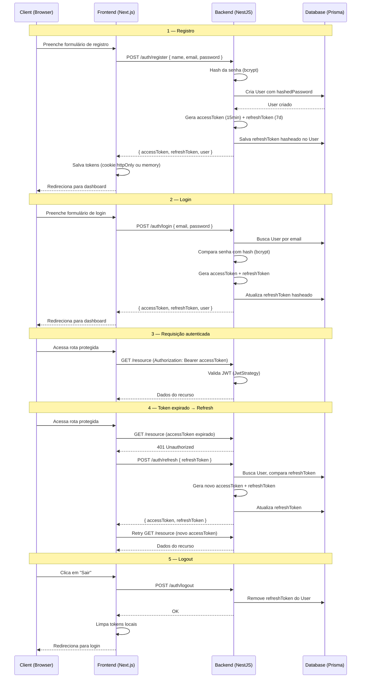

# 07 — Autenticação: Login, Tokens e Proteção de Rotas

## 7.1 — Visão geral

### Fluxo completo de autenticação JWT



### Como funciona

| Conceito | Descrição |
|---|---|
| **Access Token** | JWT de curta duração (15 min). Enviado em todo request via header `Authorization: Bearer <token>`. Contém `sub` (userId), `email` e `role`. |
| **Refresh Token** | JWT de longa duração (7 dias). Usado exclusivamente para obter um novo par de tokens quando o access token expira. Armazenado hasheado no banco. |
| **Rotação de tokens** | A cada refresh, ambos os tokens são regenerados e o antigo refresh token é invalidado. Isso limita a janela de ataque caso um refresh token vaze. |
| **bcrypt** | Algoritmo de hash usado para senhas e refresh tokens. Salt rounds: 10. |
| **Guards (NestJS)** | `JwtAuthGuard` valida o access token. `RolesGuard` verifica se o usuário tem a role necessária. Ambos são aplicados via decorators. |
| **Middleware (Next.js)** | Intercepta requests no edge runtime. Redireciona usuários não autenticados para `/login` e usuários autenticados para fora de `/login`. |

### Estrutura de pastas

```
backend/
├── src/
│   └── auth/
│       ├── auth.module.ts
│       ├── auth.controller.ts
│       ├── auth.service.ts
│       ├── strategies/
│       │   ├── jwt.strategy.ts
│       │   └── jwt-refresh.strategy.ts
│       ├── guards/
│       │   ├── jwt-auth.guard.ts
│       │   └── roles.guard.ts
│       ├── decorators/
│       │   ├── current-user.decorator.ts
│       │   └── roles.decorator.ts
│       └── dto/
│           ├── register.dto.ts
│           ├── login.dto.ts
│           └── auth-response.dto.ts

frontend/
├── src/
│   ├── lib/
│   │   └── api.ts
│   ├── providers/
│   │   └── auth-provider.tsx
│   ├── hooks/
│   │   └── use-auth.ts
│   ├── features/
│   │   └── auth/
│   │       ├── services/
│   │       │   └── auth.service.ts
│   │       └── components/
│   │           ├── login-form.tsx
│   │           └── register-form.tsx
│   ├── middleware.ts
│   └── app/
│       └── (auth)/
│           ├── login/
│           │   └── page.tsx
│           └── register/
│               └── page.tsx
```

---

## 7.2 — Backend: código COMPLETO

### Prisma Schema (parte de User)

```prisma
// prisma/schema.prisma

enum Role {
  USER
  MANAGER
  ADMIN
}

model User {
  id             String   @id @default(cuid())
  email          String   @unique
  name           String
  hashedPassword String
  refreshToken   String?
  role           Role     @default(USER)
  isActive       Boolean  @default(true)
  createdAt      DateTime @default(now())
  updatedAt      DateTime @updatedAt

  @@map("users")
}
```

> **Detalhe**: `refreshToken` armazena o hash bcrypt do token, nunca o token em texto plano. Isso garante que, mesmo com acesso ao banco, não é possível usar o refresh token diretamente.

---

### DTOs

#### `register.dto.ts`

```typescript
// src/auth/dto/register.dto.ts

import { IsEmail, IsNotEmpty, IsString, MinLength } from 'class-validator';
import { ApiProperty } from '@nestjs/swagger';

export class RegisterDto {
  @ApiProperty({ example: 'João Silva' })
  @IsString()
  @IsNotEmpty()
  name: string;

  @ApiProperty({ example: 'joao@email.com' })
  @IsEmail()
  email: string;

  @ApiProperty({ example: 'senhaForte123', minLength: 8 })
  @IsString()
  @MinLength(8)
  password: string;
}
```

#### `login.dto.ts`

```typescript
// src/auth/dto/login.dto.ts

import { IsEmail, IsString, MinLength } from 'class-validator';
import { ApiProperty } from '@nestjs/swagger';

export class LoginDto {
  @ApiProperty({ example: 'joao@email.com' })
  @IsEmail()
  email: string;

  @ApiProperty({ example: 'senhaForte123' })
  @IsString()
  @MinLength(8)
  password: string;
}
```

#### `auth-response.dto.ts`

```typescript
// src/auth/dto/auth-response.dto.ts

import { ApiProperty } from '@nestjs/swagger';
import { Role } from '@prisma/client';

class UserResponseDto {
  @ApiProperty()
  id: string;

  @ApiProperty()
  email: string;

  @ApiProperty()
  name: string;

  @ApiProperty({ enum: Role })
  role: Role;
}

export class AuthResponseDto {
  @ApiProperty()
  accessToken: string;

  @ApiProperty()
  refreshToken: string;

  @ApiProperty({ type: UserResponseDto })
  user: UserResponseDto;
}
```

---

### Strategies

#### `jwt.strategy.ts`

```typescript
// src/auth/strategies/jwt.strategy.ts

import { Injectable, UnauthorizedException } from '@nestjs/common';
import { ConfigService } from '@nestjs/config';
import { PassportStrategy } from '@nestjs/passport';
import { ExtractJwt, Strategy } from 'passport-jwt';
import { PrismaService } from '../../prisma/prisma.service';

export interface JwtPayload {
  sub: string;
  email: string;
  role: string;
}

@Injectable()
export class JwtStrategy extends PassportStrategy(Strategy, 'jwt') {
  constructor(
    private readonly config: ConfigService,
    private readonly prisma: PrismaService,
  ) {
    super({
      jwtFromRequest: ExtractJwt.fromAuthHeaderAsBearerToken(),
      ignoreExpiration: false,
      secretOrKey: config.getOrThrow<string>('JWT_ACCESS_SECRET'),
    });
  }

  async validate(payload: JwtPayload) {
    const user = await this.prisma.user.findUnique({
      where: { id: payload.sub },
      select: {
        id: true,
        email: true,
        name: true,
        role: true,
        isActive: true,
      },
    });

    if (!user || !user.isActive) {
      throw new UnauthorizedException('Usuário não encontrado ou inativo');
    }

    return user;
  }
}
```

#### `jwt-refresh.strategy.ts`

```typescript
// src/auth/strategies/jwt-refresh.strategy.ts

import { Injectable, UnauthorizedException } from '@nestjs/common';
import { ConfigService } from '@nestjs/config';
import { PassportStrategy } from '@nestjs/passport';
import { ExtractJwt, Strategy } from 'passport-jwt';
import { Request } from 'express';

export interface JwtRefreshPayload {
  sub: string;
  email: string;
  refreshToken: string;
}

@Injectable()
export class JwtRefreshStrategy extends PassportStrategy(Strategy, 'jwt-refresh') {
  constructor(private readonly config: ConfigService) {
    super({
      jwtFromRequest: ExtractJwt.fromBodyField('refreshToken'),
      ignoreExpiration: false,
      secretOrKey: config.getOrThrow<string>('JWT_REFRESH_SECRET'),
      passReqToCallback: true,
    });
  }

  async validate(req: Request, payload: { sub: string; email: string }) {
    const refreshToken = req.body?.refreshToken;

    if (!refreshToken) {
      throw new UnauthorizedException('Refresh token não fornecido');
    }

    return {
      ...payload,
      refreshToken,
    };
  }
}
```

---

### Guards

#### `jwt-auth.guard.ts`

```typescript
// src/auth/guards/jwt-auth.guard.ts

import {
  ExecutionContext,
  Injectable,
  UnauthorizedException,
} from '@nestjs/common';
import { Reflector } from '@nestjs/core';
import { AuthGuard } from '@nestjs/passport';
import { IS_PUBLIC_KEY } from '../decorators/public.decorator';

@Injectable()
export class JwtAuthGuard extends AuthGuard('jwt') {
  constructor(private readonly reflector: Reflector) {
    super();
  }

  canActivate(context: ExecutionContext) {
    const isPublic = this.reflector.getAllAndOverride<boolean>(IS_PUBLIC_KEY, [
      context.getHandler(),
      context.getClass(),
    ]);

    if (isPublic) {
      return true;
    }

    return super.canActivate(context);
  }

  handleRequest<TUser>(err: Error | null, user: TUser | false): TUser {
    if (err || !user) {
      throw err || new UnauthorizedException('Token inválido ou expirado');
    }
    return user;
  }
}
```

#### `roles.guard.ts`

```typescript
// src/auth/guards/roles.guard.ts

import {
  CanActivate,
  ExecutionContext,
  ForbiddenException,
  Injectable,
} from '@nestjs/common';
import { Reflector } from '@nestjs/core';
import { Role } from '@prisma/client';
import { ROLES_KEY } from '../decorators/roles.decorator';

@Injectable()
export class RolesGuard implements CanActivate {
  constructor(private readonly reflector: Reflector) {}

  canActivate(context: ExecutionContext): boolean {
    const requiredRoles = this.reflector.getAllAndOverride<Role[]>(ROLES_KEY, [
      context.getHandler(),
      context.getClass(),
    ]);

    if (!requiredRoles || requiredRoles.length === 0) {
      return true;
    }

    const { user } = context.switchToHttp().getRequest();

    if (!user) {
      throw new ForbiddenException('Usuário não autenticado');
    }

    const hasRole = requiredRoles.some((role) => user.role === role);

    if (!hasRole) {
      throw new ForbiddenException(
        `Acesso negado. Roles necessárias: ${requiredRoles.join(', ')}`,
      );
    }

    return true;
  }
}
```

---

### Decorators

#### `current-user.decorator.ts`

```typescript
// src/auth/decorators/current-user.decorator.ts

import { createParamDecorator, ExecutionContext } from '@nestjs/common';

export interface AuthenticatedUser {
  id: string;
  email: string;
  name: string;
  role: string;
  isActive: boolean;
}

export const CurrentUser = createParamDecorator(
  (data: keyof AuthenticatedUser | undefined, ctx: ExecutionContext) => {
    const request = ctx.switchToHttp().getRequest();
    const user = request.user as AuthenticatedUser;

    if (data) {
      return user[data];
    }

    return user;
  },
);
```

#### `roles.decorator.ts`

```typescript
// src/auth/decorators/roles.decorator.ts

import { SetMetadata } from '@nestjs/common';
import { Role } from '@prisma/client';

export const ROLES_KEY = 'roles';

export const Roles = (...roles: Role[]) => SetMetadata(ROLES_KEY, roles);
```

#### `public.decorator.ts`

```typescript
// src/auth/decorators/public.decorator.ts

import { SetMetadata } from '@nestjs/common';

export const IS_PUBLIC_KEY = 'isPublic';

export const Public = () => SetMetadata(IS_PUBLIC_KEY, true);
```

---

### `auth.service.ts`

```typescript
// src/auth/auth.service.ts

import {
  ConflictException,
  ForbiddenException,
  Injectable,
  UnauthorizedException,
} from '@nestjs/common';
import { ConfigService } from '@nestjs/config';
import { JwtService } from '@nestjs/jwt';
import { Role } from '@prisma/client';
import * as bcrypt from 'bcrypt';
import { PrismaService } from '../prisma/prisma.service';
import { RegisterDto } from './dto/register.dto';
import { LoginDto } from './dto/login.dto';
import { AuthResponseDto } from './dto/auth-response.dto';

interface TokenPair {
  accessToken: string;
  refreshToken: string;
}

@Injectable()
export class AuthService {
  private readonly BCRYPT_ROUNDS = 10;

  constructor(
    private readonly prisma: PrismaService,
    private readonly jwt: JwtService,
    private readonly config: ConfigService,
  ) {}

  async register(dto: RegisterDto): Promise<AuthResponseDto> {
    const existingUser = await this.prisma.user.findUnique({
      where: { email: dto.email },
    });

    if (existingUser) {
      throw new ConflictException('E-mail já cadastrado');
    }

    const hashedPassword = await bcrypt.hash(dto.password, this.BCRYPT_ROUNDS);

    const user = await this.prisma.user.create({
      data: {
        name: dto.name,
        email: dto.email,
        hashedPassword,
        role: Role.USER,
      },
      select: {
        id: true,
        email: true,
        name: true,
        role: true,
      },
    });

    const tokens = await this.generateTokens(user.id, user.email, user.role);
    await this.updateRefreshTokenHash(user.id, tokens.refreshToken);

    return {
      ...tokens,
      user,
    };
  }

  async login(dto: LoginDto): Promise<AuthResponseDto> {
    const user = await this.prisma.user.findUnique({
      where: { email: dto.email },
    });

    if (!user) {
      throw new UnauthorizedException('Credenciais inválidas');
    }

    if (!user.isActive) {
      throw new ForbiddenException('Conta desativada. Entre em contato com o suporte.');
    }

    const passwordValid = await bcrypt.compare(dto.password, user.hashedPassword);

    if (!passwordValid) {
      throw new UnauthorizedException('Credenciais inválidas');
    }

    const tokens = await this.generateTokens(user.id, user.email, user.role);
    await this.updateRefreshTokenHash(user.id, tokens.refreshToken);

    return {
      ...tokens,
      user: {
        id: user.id,
        email: user.email,
        name: user.name,
        role: user.role,
      },
    };
  }

  async refresh(userId: string, currentRefreshToken: string): Promise<AuthResponseDto> {
    const user = await this.prisma.user.findUnique({
      where: { id: userId },
    });

    if (!user || !user.refreshToken) {
      throw new ForbiddenException('Acesso negado');
    }

    if (!user.isActive) {
      throw new ForbiddenException('Conta desativada');
    }

    const tokenMatches = await bcrypt.compare(
      currentRefreshToken,
      user.refreshToken,
    );

    if (!tokenMatches) {
      await this.prisma.user.update({
        where: { id: userId },
        data: { refreshToken: null },
      });
      throw new ForbiddenException(
        'Refresh token inválido. Todos os tokens foram revogados por segurança.',
      );
    }

    const tokens = await this.generateTokens(user.id, user.email, user.role);
    await this.updateRefreshTokenHash(user.id, tokens.refreshToken);

    return {
      ...tokens,
      user: {
        id: user.id,
        email: user.email,
        name: user.name,
        role: user.role,
      },
    };
  }

  async logout(userId: string): Promise<void> {
    await this.prisma.user.update({
      where: { id: userId },
      data: { refreshToken: null },
    });
  }

  async getMe(userId: string) {
    const user = await this.prisma.user.findUnique({
      where: { id: userId },
      select: {
        id: true,
        email: true,
        name: true,
        role: true,
        isActive: true,
        createdAt: true,
      },
    });

    if (!user) {
      throw new UnauthorizedException('Usuário não encontrado');
    }

    return user;
  }

  private async generateTokens(
    userId: string,
    email: string,
    role: Role,
  ): Promise<TokenPair> {
    const payload = { sub: userId, email, role };

    const [accessToken, refreshToken] = await Promise.all([
      this.jwt.signAsync(payload, {
        secret: this.config.getOrThrow<string>('JWT_ACCESS_SECRET'),
        expiresIn: '15m',
      }),
      this.jwt.signAsync(payload, {
        secret: this.config.getOrThrow<string>('JWT_REFRESH_SECRET'),
        expiresIn: '7d',
      }),
    ]);

    return { accessToken, refreshToken };
  }

  private async updateRefreshTokenHash(
    userId: string,
    refreshToken: string,
  ): Promise<void> {
    const hash = await bcrypt.hash(refreshToken, this.BCRYPT_ROUNDS);

    await this.prisma.user.update({
      where: { id: userId },
      data: { refreshToken: hash },
    });
  }
}
```

---

### `auth.controller.ts`

```typescript
// src/auth/auth.controller.ts

import {
  Body,
  Controller,
  Get,
  HttpCode,
  HttpStatus,
  Post,
  UseGuards,
} from '@nestjs/common';
import {
  ApiBearerAuth,
  ApiConflictResponse,
  ApiCreatedResponse,
  ApiForbiddenResponse,
  ApiOkResponse,
  ApiOperation,
  ApiTags,
  ApiUnauthorizedResponse,
} from '@nestjs/swagger';
import { AuthGuard } from '@nestjs/passport';
import { AuthService } from './auth.service';
import { RegisterDto } from './dto/register.dto';
import { LoginDto } from './dto/login.dto';
import { AuthResponseDto } from './dto/auth-response.dto';
import { CurrentUser, AuthenticatedUser } from './decorators/current-user.decorator';
import { Public } from './decorators/public.decorator';
import { JwtAuthGuard } from './guards/jwt-auth.guard';

@ApiTags('Auth')
@Controller('auth')
export class AuthController {
  constructor(private readonly authService: AuthService) {}

  @Public()
  @Post('register')
  @ApiOperation({ summary: 'Criar nova conta' })
  @ApiCreatedResponse({ type: AuthResponseDto })
  @ApiConflictResponse({ description: 'E-mail já cadastrado' })
  async register(@Body() dto: RegisterDto): Promise<AuthResponseDto> {
    return this.authService.register(dto);
  }

  @Public()
  @Post('login')
  @HttpCode(HttpStatus.OK)
  @ApiOperation({ summary: 'Autenticar usuário' })
  @ApiOkResponse({ type: AuthResponseDto })
  @ApiUnauthorizedResponse({ description: 'Credenciais inválidas' })
  async login(@Body() dto: LoginDto): Promise<AuthResponseDto> {
    return this.authService.login(dto);
  }

  @Public()
  @UseGuards(AuthGuard('jwt-refresh'))
  @Post('refresh')
  @HttpCode(HttpStatus.OK)
  @ApiOperation({ summary: 'Renovar tokens com refresh token' })
  @ApiOkResponse({ type: AuthResponseDto })
  @ApiForbiddenResponse({ description: 'Refresh token inválido' })
  async refresh(
    @CurrentUser('id') userId: string,
    @CurrentUser('refreshToken') refreshToken: string,
  ): Promise<AuthResponseDto> {
    return this.authService.refresh(userId, refreshToken);
  }

  @Post('logout')
  @HttpCode(HttpStatus.OK)
  @UseGuards(JwtAuthGuard)
  @ApiBearerAuth()
  @ApiOperation({ summary: 'Encerrar sessão' })
  @ApiOkResponse({ description: 'Logout realizado com sucesso' })
  async logout(@CurrentUser('id') userId: string): Promise<{ message: string }> {
    await this.authService.logout(userId);
    return { message: 'Logout realizado com sucesso' };
  }

  @Get('me')
  @UseGuards(JwtAuthGuard)
  @ApiBearerAuth()
  @ApiOperation({ summary: 'Obter dados do usuário autenticado' })
  @ApiOkResponse({ description: 'Dados do usuário' })
  @ApiUnauthorizedResponse({ description: 'Token inválido' })
  async me(@CurrentUser('id') userId: string) {
    return this.authService.getMe(userId);
  }
}
```

---

### `auth.module.ts`

```typescript
// src/auth/auth.module.ts

import { Module } from '@nestjs/common';
import { JwtModule } from '@nestjs/jwt';
import { PassportModule } from '@nestjs/passport';
import { APP_GUARD } from '@nestjs/core';
import { AuthController } from './auth.controller';
import { AuthService } from './auth.service';
import { JwtStrategy } from './strategies/jwt.strategy';
import { JwtRefreshStrategy } from './strategies/jwt-refresh.strategy';
import { JwtAuthGuard } from './guards/jwt-auth.guard';
import { RolesGuard } from './guards/roles.guard';

@Module({
  imports: [
    PassportModule.register({ defaultStrategy: 'jwt' }),
    JwtModule.register({}),
  ],
  controllers: [AuthController],
  providers: [
    AuthService,
    JwtStrategy,
    JwtRefreshStrategy,
    {
      provide: APP_GUARD,
      useClass: JwtAuthGuard,
    },
    {
      provide: APP_GUARD,
      useClass: RolesGuard,
    },
  ],
  exports: [AuthService],
})
export class AuthModule {}
```

> **Por que `APP_GUARD`?** Registrar `JwtAuthGuard` como guard global faz com que **todas** as rotas sejam protegidas por padrão. Rotas públicas usam o decorator `@Public()` para desativar a verificação. Isso segue o princípio de "secure by default".

---

### Variáveis de ambiente necessárias

```env
# .env
JWT_ACCESS_SECRET=suaChaveSecretaParaAccessToken_mude_em_producao
JWT_REFRESH_SECRET=outraChaveSecretaParaRefreshToken_mude_em_producao
```

---

## 7.3 — Frontend: código COMPLETO

### `lib/api.ts` — Axios instance com interceptors

```typescript
// src/lib/api.ts

import axios, { AxiosError, InternalAxiosRequestConfig } from 'axios';

interface QueueItem {
  resolve: (token: string) => void;
  reject: (error: unknown) => void;
}

let isRefreshing = false;
let failedQueue: QueueItem[] = [];

const processQueue = (error: unknown, token: string | null = null) => {
  failedQueue.forEach((item) => {
    if (error) {
      item.reject(error);
    } else {
      item.resolve(token!);
    }
  });
  failedQueue = [];
};

export const TOKEN_KEY = 'auth_access_token';
export const REFRESH_TOKEN_KEY = 'auth_refresh_token';

export function getAccessToken(): string | null {
  if (typeof window === 'undefined') return null;
  return localStorage.getItem(TOKEN_KEY);
}

export function getRefreshToken(): string | null {
  if (typeof window === 'undefined') return null;
  return localStorage.getItem(REFRESH_TOKEN_KEY);
}

export function setTokens(accessToken: string, refreshToken: string): void {
  localStorage.setItem(TOKEN_KEY, accessToken);
  localStorage.setItem(REFRESH_TOKEN_KEY, refreshToken);
}

export function clearTokens(): void {
  localStorage.removeItem(TOKEN_KEY);
  localStorage.removeItem(REFRESH_TOKEN_KEY);
}

const api = axios.create({
  baseURL: process.env.NEXT_PUBLIC_API_URL ?? 'http://localhost:3001',
  headers: { 'Content-Type': 'application/json' },
  timeout: 15_000,
});

api.interceptors.request.use((config: InternalAxiosRequestConfig) => {
  const token = getAccessToken();

  if (token && config.headers) {
    config.headers.Authorization = `Bearer ${token}`;
  }

  return config;
});

api.interceptors.response.use(
  (response) => response,
  async (error: AxiosError) => {
    const originalRequest = error.config as InternalAxiosRequestConfig & {
      _retry?: boolean;
    };

    if (!originalRequest) {
      return Promise.reject(error);
    }

    const isUnauthorized = error.response?.status === 401;
    const isNotRetry = !originalRequest._retry;
    const isNotAuthRoute = !originalRequest.url?.includes('/auth/');

    if (isUnauthorized && isNotRetry && isNotAuthRoute) {
      if (isRefreshing) {
        return new Promise<string>((resolve, reject) => {
          failedQueue.push({ resolve, reject });
        }).then((token) => {
          if (originalRequest.headers) {
            originalRequest.headers.Authorization = `Bearer ${token}`;
          }
          return api(originalRequest);
        });
      }

      originalRequest._retry = true;
      isRefreshing = true;

      const refreshToken = getRefreshToken();

      if (!refreshToken) {
        clearTokens();
        window.location.href = '/login';
        return Promise.reject(error);
      }

      try {
        const { data } = await axios.post(
          `${api.defaults.baseURL}/auth/refresh`,
          { refreshToken },
        );

        setTokens(data.accessToken, data.refreshToken);

        if (originalRequest.headers) {
          originalRequest.headers.Authorization = `Bearer ${data.accessToken}`;
        }

        processQueue(null, data.accessToken);

        return api(originalRequest);
      } catch (refreshError) {
        processQueue(refreshError);
        clearTokens();
        window.location.href = '/login';
        return Promise.reject(refreshError);
      } finally {
        isRefreshing = false;
      }
    }

    return Promise.reject(error);
  },
);

export { api };
```

> **Fila de retry**: quando múltiplas requisições falham simultaneamente com 401, apenas uma tenta o refresh. As demais ficam na `failedQueue` e são reenviadas com o novo token assim que o refresh completa. Isso evita múltiplas chamadas ao endpoint `/auth/refresh`.

---

### `features/auth/services/auth.service.ts`

```typescript
// src/features/auth/services/auth.service.ts

import { api, setTokens, clearTokens } from '@/lib/api';

export interface User {
  id: string;
  email: string;
  name: string;
  role: 'USER' | 'MANAGER' | 'ADMIN';
  isActive?: boolean;
  createdAt?: string;
}

export interface AuthResponse {
  accessToken: string;
  refreshToken: string;
  user: User;
}

interface RegisterPayload {
  name: string;
  email: string;
  password: string;
}

interface LoginPayload {
  email: string;
  password: string;
}

export const authService = {
  async register(payload: RegisterPayload): Promise<AuthResponse> {
    const { data } = await api.post<AuthResponse>('/auth/register', payload);
    setTokens(data.accessToken, data.refreshToken);
    return data;
  },

  async login(payload: LoginPayload): Promise<AuthResponse> {
    const { data } = await api.post<AuthResponse>('/auth/login', payload);
    setTokens(data.accessToken, data.refreshToken);
    return data;
  },

  async logout(): Promise<void> {
    try {
      await api.post('/auth/logout');
    } finally {
      clearTokens();
    }
  },

  async getMe(): Promise<User> {
    const { data } = await api.get<User>('/auth/me');
    return data;
  },
};
```

---

### `providers/auth-provider.tsx`

```tsx
// src/providers/auth-provider.tsx

'use client';

import {
  createContext,
  useCallback,
  useEffect,
  useMemo,
  useState,
  type ReactNode,
} from 'react';
import { useRouter } from 'next/navigation';
import {
  authService,
  type AuthResponse,
  type User,
} from '@/features/auth/services/auth.service';
import { getAccessToken, clearTokens } from '@/lib/api';

export interface AuthContextValue {
  user: User | null;
  isLoading: boolean;
  isAuthenticated: boolean;
  login: (email: string, password: string) => Promise<void>;
  register: (name: string, email: string, password: string) => Promise<void>;
  logout: () => Promise<void>;
  hasRole: (role: User['role'] | User['role'][]) => boolean;
}

export const AuthContext = createContext<AuthContextValue | null>(null);

interface AuthProviderProps {
  children: ReactNode;
}

export function AuthProvider({ children }: AuthProviderProps) {
  const [user, setUser] = useState<User | null>(null);
  const [isLoading, setIsLoading] = useState(true);
  const router = useRouter();

  const fetchUser = useCallback(async () => {
    const token = getAccessToken();

    if (!token) {
      setUser(null);
      setIsLoading(false);
      return;
    }

    try {
      const currentUser = await authService.getMe();
      setUser(currentUser);
    } catch {
      clearTokens();
      setUser(null);
    } finally {
      setIsLoading(false);
    }
  }, []);

  useEffect(() => {
    fetchUser();
  }, [fetchUser]);

  const login = useCallback(
    async (email: string, password: string) => {
      const response: AuthResponse = await authService.login({ email, password });
      setUser(response.user);
      router.push('/dashboard');
    },
    [router],
  );

  const register = useCallback(
    async (name: string, email: string, password: string) => {
      const response: AuthResponse = await authService.register({
        name,
        email,
        password,
      });
      setUser(response.user);
      router.push('/dashboard');
    },
    [router],
  );

  const logout = useCallback(async () => {
    await authService.logout();
    setUser(null);
    router.push('/login');
  }, [router]);

  const hasRole = useCallback(
    (role: User['role'] | User['role'][]) => {
      if (!user) return false;

      if (Array.isArray(role)) {
        return role.includes(user.role);
      }

      return user.role === role;
    },
    [user],
  );

  const value = useMemo<AuthContextValue>(
    () => ({
      user,
      isLoading,
      isAuthenticated: !!user,
      login,
      register,
      logout,
      hasRole,
    }),
    [user, isLoading, login, register, logout, hasRole],
  );

  return <AuthContext.Provider value={value}>{children}</AuthContext.Provider>;
}
```

---

### `hooks/use-auth.ts`

```typescript
// src/hooks/use-auth.ts

'use client';

import { useContext } from 'react';
import { AuthContext, type AuthContextValue } from '@/providers/auth-provider';

export function useAuth(): AuthContextValue {
  const context = useContext(AuthContext);

  if (!context) {
    throw new Error(
      'useAuth deve ser usado dentro de um <AuthProvider>. ' +
        'Verifique se o provider está presente no layout raiz.',
    );
  }

  return context;
}
```

---

### `features/auth/components/login-form.tsx`

```tsx
// src/features/auth/components/login-form.tsx

'use client';

import { useState, type FormEvent } from 'react';
import Link from 'next/link';
import { useAuth } from '@/hooks/use-auth';
import { AxiosError } from 'axios';

export function LoginForm() {
  const { login } = useAuth();
  const [email, setEmail] = useState('');
  const [password, setPassword] = useState('');
  const [error, setError] = useState('');
  const [isSubmitting, setIsSubmitting] = useState(false);

  async function handleSubmit(e: FormEvent) {
    e.preventDefault();
    setError('');
    setIsSubmitting(true);

    try {
      await login(email, password);
    } catch (err) {
      if (err instanceof AxiosError) {
        const message =
          err.response?.data?.message ?? 'Erro ao fazer login. Tente novamente.';
        setError(Array.isArray(message) ? message[0] : message);
      } else {
        setError('Erro inesperado. Tente novamente.');
      }
    } finally {
      setIsSubmitting(false);
    }
  }

  return (
    <form onSubmit={handleSubmit} className="space-y-6">
      <div>
        <label htmlFor="email" className="block text-sm font-medium text-gray-700">
          E-mail
        </label>
        <input
          id="email"
          type="email"
          required
          autoComplete="email"
          value={email}
          onChange={(e) => setEmail(e.target.value)}
          className="mt-1 block w-full rounded-lg border border-gray-300 px-4 py-2
                     shadow-sm focus:border-blue-500 focus:ring-blue-500"
          placeholder="seu@email.com"
        />
      </div>

      <div>
        <label htmlFor="password" className="block text-sm font-medium text-gray-700">
          Senha
        </label>
        <input
          id="password"
          type="password"
          required
          autoComplete="current-password"
          minLength={8}
          value={password}
          onChange={(e) => setPassword(e.target.value)}
          className="mt-1 block w-full rounded-lg border border-gray-300 px-4 py-2
                     shadow-sm focus:border-blue-500 focus:ring-blue-500"
          placeholder="••••••••"
        />
      </div>

      {error && (
        <div className="rounded-lg bg-red-50 p-3 text-sm text-red-600" role="alert">
          {error}
        </div>
      )}

      <button
        type="submit"
        disabled={isSubmitting}
        className="w-full rounded-lg bg-blue-600 px-4 py-2 text-white font-medium
                   hover:bg-blue-700 focus:outline-none focus:ring-2 focus:ring-blue-500
                   focus:ring-offset-2 disabled:opacity-50 disabled:cursor-not-allowed
                   transition-colors"
      >
        {isSubmitting ? 'Entrando...' : 'Entrar'}
      </button>

      <p className="text-center text-sm text-gray-600">
        Não tem uma conta?{' '}
        <Link href="/register" className="font-medium text-blue-600 hover:text-blue-500">
          Criar conta
        </Link>
      </p>
    </form>
  );
}
```

---

### `features/auth/components/register-form.tsx`

```tsx
// src/features/auth/components/register-form.tsx

'use client';

import { useState, type FormEvent } from 'react';
import Link from 'next/link';
import { useAuth } from '@/hooks/use-auth';
import { AxiosError } from 'axios';

export function RegisterForm() {
  const { register } = useAuth();
  const [name, setName] = useState('');
  const [email, setEmail] = useState('');
  const [password, setPassword] = useState('');
  const [confirmPassword, setConfirmPassword] = useState('');
  const [error, setError] = useState('');
  const [isSubmitting, setIsSubmitting] = useState(false);

  async function handleSubmit(e: FormEvent) {
    e.preventDefault();
    setError('');

    if (password !== confirmPassword) {
      setError('As senhas não coincidem.');
      return;
    }

    setIsSubmitting(true);

    try {
      await register(name, email, password);
    } catch (err) {
      if (err instanceof AxiosError) {
        const message =
          err.response?.data?.message ?? 'Erro ao criar conta. Tente novamente.';
        setError(Array.isArray(message) ? message[0] : message);
      } else {
        setError('Erro inesperado. Tente novamente.');
      }
    } finally {
      setIsSubmitting(false);
    }
  }

  return (
    <form onSubmit={handleSubmit} className="space-y-6">
      <div>
        <label htmlFor="name" className="block text-sm font-medium text-gray-700">
          Nome completo
        </label>
        <input
          id="name"
          type="text"
          required
          autoComplete="name"
          value={name}
          onChange={(e) => setName(e.target.value)}
          className="mt-1 block w-full rounded-lg border border-gray-300 px-4 py-2
                     shadow-sm focus:border-blue-500 focus:ring-blue-500"
          placeholder="João Silva"
        />
      </div>

      <div>
        <label htmlFor="email" className="block text-sm font-medium text-gray-700">
          E-mail
        </label>
        <input
          id="email"
          type="email"
          required
          autoComplete="email"
          value={email}
          onChange={(e) => setEmail(e.target.value)}
          className="mt-1 block w-full rounded-lg border border-gray-300 px-4 py-2
                     shadow-sm focus:border-blue-500 focus:ring-blue-500"
          placeholder="seu@email.com"
        />
      </div>

      <div>
        <label htmlFor="password" className="block text-sm font-medium text-gray-700">
          Senha
        </label>
        <input
          id="password"
          type="password"
          required
          autoComplete="new-password"
          minLength={8}
          value={password}
          onChange={(e) => setPassword(e.target.value)}
          className="mt-1 block w-full rounded-lg border border-gray-300 px-4 py-2
                     shadow-sm focus:border-blue-500 focus:ring-blue-500"
          placeholder="Mínimo 8 caracteres"
        />
      </div>

      <div>
        <label
          htmlFor="confirmPassword"
          className="block text-sm font-medium text-gray-700"
        >
          Confirmar senha
        </label>
        <input
          id="confirmPassword"
          type="password"
          required
          autoComplete="new-password"
          minLength={8}
          value={confirmPassword}
          onChange={(e) => setConfirmPassword(e.target.value)}
          className="mt-1 block w-full rounded-lg border border-gray-300 px-4 py-2
                     shadow-sm focus:border-blue-500 focus:ring-blue-500"
          placeholder="Repita a senha"
        />
      </div>

      {error && (
        <div className="rounded-lg bg-red-50 p-3 text-sm text-red-600" role="alert">
          {error}
        </div>
      )}

      <button
        type="submit"
        disabled={isSubmitting}
        className="w-full rounded-lg bg-blue-600 px-4 py-2 text-white font-medium
                   hover:bg-blue-700 focus:outline-none focus:ring-2 focus:ring-blue-500
                   focus:ring-offset-2 disabled:opacity-50 disabled:cursor-not-allowed
                   transition-colors"
      >
        {isSubmitting ? 'Criando conta...' : 'Criar conta'}
      </button>

      <p className="text-center text-sm text-gray-600">
        Já tem uma conta?{' '}
        <Link href="/login" className="font-medium text-blue-600 hover:text-blue-500">
          Fazer login
        </Link>
      </p>
    </form>
  );
}
```

---

### `middleware.ts` — Next.js edge middleware

```typescript
// src/middleware.ts

import { NextResponse, type NextRequest } from 'next/server';

const PUBLIC_ROUTES = ['/login', '/register', '/forgot-password'];

const AUTH_ROUTES = ['/login', '/register'];

export function middleware(request: NextRequest) {
  const { pathname } = request.nextUrl;
  const token = request.cookies.get('auth_access_token')?.value;

  const isPublicRoute = PUBLIC_ROUTES.some((route) => pathname.startsWith(route));
  const isAuthRoute = AUTH_ROUTES.some((route) => pathname.startsWith(route));
  const isApiRoute = pathname.startsWith('/api');
  const isStaticAsset =
    pathname.startsWith('/_next') ||
    pathname.startsWith('/favicon') ||
    pathname.includes('.');

  if (isApiRoute || isStaticAsset) {
    return NextResponse.next();
  }

  if (!token && !isPublicRoute) {
    const loginUrl = new URL('/login', request.url);
    loginUrl.searchParams.set('callbackUrl', pathname);
    return NextResponse.redirect(loginUrl);
  }

  if (token && isAuthRoute) {
    return NextResponse.redirect(new URL('/dashboard', request.url));
  }

  return NextResponse.next();
}

export const config = {
  matcher: ['/((?!_next/static|_next/image|favicon.ico).*)'],
};
```

> **Nota sobre tokens e cookies**: O middleware do Next.js roda no edge e só tem acesso a cookies. Para que funcione, o frontend deve salvar o access token também como cookie. Uma alternativa é um endpoint BFF (`/api/auth/session`) que valide o token server-side. A implementação acima usa `localStorage` para chamadas API e cookie para o middleware. Veja a seção de integração abaixo.

#### Sincronizando localStorage com cookie

Adicione ao `lib/api.ts` após `setTokens`:

```typescript
// Adicionar no setTokens do lib/api.ts
export function setTokens(accessToken: string, refreshToken: string): void {
  localStorage.setItem(TOKEN_KEY, accessToken);
  localStorage.setItem(REFRESH_TOKEN_KEY, refreshToken);
  document.cookie = `auth_access_token=${accessToken}; path=/; max-age=${15 * 60}; SameSite=Lax`;
}

export function clearTokens(): void {
  localStorage.removeItem(TOKEN_KEY);
  localStorage.removeItem(REFRESH_TOKEN_KEY);
  document.cookie = 'auth_access_token=; path=/; max-age=0';
}
```

---

### `app/(auth)/login/page.tsx`

```tsx
// src/app/(auth)/login/page.tsx

import { LoginForm } from '@/features/auth/components/login-form';

export const metadata = {
  title: 'Login',
  description: 'Faça login na sua conta',
};

export default function LoginPage() {
  return (
    <div className="flex min-h-screen items-center justify-center bg-gray-50 px-4">
      <div className="w-full max-w-md space-y-8">
        <div className="text-center">
          <h1 className="text-3xl font-bold tracking-tight text-gray-900">
            Bem-vindo de volta
          </h1>
          <p className="mt-2 text-gray-600">
            Entre com suas credenciais para acessar o sistema
          </p>
        </div>
        <div className="rounded-xl bg-white p-8 shadow-lg">
          <LoginForm />
        </div>
      </div>
    </div>
  );
}
```

### `app/(auth)/register/page.tsx`

```tsx
// src/app/(auth)/register/page.tsx

import { RegisterForm } from '@/features/auth/components/register-form';

export const metadata = {
  title: 'Criar conta',
  description: 'Crie sua conta para acessar o sistema',
};

export default function RegisterPage() {
  return (
    <div className="flex min-h-screen items-center justify-center bg-gray-50 px-4">
      <div className="w-full max-w-md space-y-8">
        <div className="text-center">
          <h1 className="text-3xl font-bold tracking-tight text-gray-900">
            Criar conta
          </h1>
          <p className="mt-2 text-gray-600">
            Preencha os dados abaixo para começar
          </p>
        </div>
        <div className="rounded-xl bg-white p-8 shadow-lg">
          <RegisterForm />
        </div>
      </div>
    </div>
  );
}
```

---

## 7.4 — RBAC (Role-Based Access Control)

### Enum de Roles

No Prisma Schema (já definido acima):

```prisma
enum Role {
  USER
  MANAGER
  ADMIN
}
```

Correspondente no frontend:

```typescript
// src/types/role.ts

export const Role = {
  USER: 'USER',
  MANAGER: 'MANAGER',
  ADMIN: 'ADMIN',
} as const;

export type Role = (typeof Role)[keyof typeof Role];

export const ROLE_LABELS: Record<Role, string> = {
  USER: 'Usuário',
  MANAGER: 'Gerente',
  ADMIN: 'Administrador',
};

export const ROLE_HIERARCHY: Record<Role, number> = {
  USER: 0,
  MANAGER: 1,
  ADMIN: 2,
};

export function hasMinimumRole(userRole: Role, requiredRole: Role): boolean {
  return ROLE_HIERARCHY[userRole] >= ROLE_HIERARCHY[requiredRole];
}
```

---

### Backend: proteger endpoints por role

Usando os decorators `@Roles()` e o `RolesGuard` já implementados na seção 7.2:

```typescript
// src/users/users.controller.ts

import { Controller, Delete, Get, Param, Patch, Body, UseGuards } from '@nestjs/common';
import { ApiBearerAuth, ApiOperation, ApiTags } from '@nestjs/swagger';
import { Role } from '@prisma/client';
import { Roles } from '../auth/decorators/roles.decorator';
import { CurrentUser, AuthenticatedUser } from '../auth/decorators/current-user.decorator';
import { UsersService } from './users.service';

@ApiTags('Users')
@ApiBearerAuth()
@Controller('users')
export class UsersController {
  constructor(private readonly usersService: UsersService) {}

  @Get()
  @Roles(Role.ADMIN, Role.MANAGER)
  @ApiOperation({ summary: 'Listar todos os usuários (ADMIN, MANAGER)' })
  async findAll() {
    return this.usersService.findAll();
  }

  @Get(':id')
  @Roles(Role.ADMIN, Role.MANAGER)
  @ApiOperation({ summary: 'Buscar usuário por ID (ADMIN, MANAGER)' })
  async findOne(@Param('id') id: string) {
    return this.usersService.findOne(id);
  }

  @Patch(':id/role')
  @Roles(Role.ADMIN)
  @ApiOperation({ summary: 'Alterar role de usuário (ADMIN)' })
  async updateRole(
    @Param('id') id: string,
    @Body('role') role: Role,
    @CurrentUser() currentUser: AuthenticatedUser,
  ) {
    return this.usersService.updateRole(id, role, currentUser.id);
  }

  @Delete(':id')
  @Roles(Role.ADMIN)
  @ApiOperation({ summary: 'Desativar usuário (ADMIN)' })
  async deactivate(
    @Param('id') id: string,
    @CurrentUser() currentUser: AuthenticatedUser,
  ) {
    return this.usersService.deactivate(id, currentUser.id);
  }
}
```

---

### Frontend: esconder UI por role

#### Componente `RoleGate`

```tsx
// src/components/role-gate.tsx

'use client';

import { type ReactNode } from 'react';
import { useAuth } from '@/hooks/use-auth';
import type { User } from '@/features/auth/services/auth.service';

interface RoleGateProps {
  children: ReactNode;
  allowedRoles: User['role'][];
  fallback?: ReactNode;
}

export function RoleGate({ children, allowedRoles, fallback = null }: RoleGateProps) {
  const { user, isLoading } = useAuth();

  if (isLoading) return null;

  if (!user || !allowedRoles.includes(user.role)) {
    return <>{fallback}</>;
  }

  return <>{children}</>;
}
```

#### Uso do `RoleGate` em componentes

```tsx
// src/app/dashboard/page.tsx

'use client';

import { RoleGate } from '@/components/role-gate';
import { useAuth } from '@/hooks/use-auth';

export default function DashboardPage() {
  const { user } = useAuth();

  return (
    <div className="mx-auto max-w-7xl px-4 py-8">
      <h1 className="text-2xl font-bold text-gray-900">
        Olá, {user?.name}
      </h1>

      <div className="mt-8 grid gap-6 sm:grid-cols-2 lg:grid-cols-3">
        {/* Visível para todos */}
        <DashboardCard title="Meus dados" href="/profile" />

        {/* Visível apenas para MANAGER e ADMIN */}
        <RoleGate allowedRoles={['MANAGER', 'ADMIN']}>
          <DashboardCard title="Gerenciar equipe" href="/team" />
          <DashboardCard title="Relatórios" href="/reports" />
        </RoleGate>

        {/* Visível apenas para ADMIN */}
        <RoleGate allowedRoles={['ADMIN']}>
          <DashboardCard title="Administração" href="/admin" />
          <DashboardCard title="Configurações do sistema" href="/admin/settings" />
        </RoleGate>
      </div>
    </div>
  );
}

function DashboardCard({ title, href }: { title: string; href: string }) {
  return (
    <a
      href={href}
      className="rounded-xl border border-gray-200 bg-white p-6 shadow-sm
                 transition-shadow hover:shadow-md"
    >
      <h2 className="text-lg font-semibold text-gray-900">{title}</h2>
    </a>
  );
}
```

#### Hook `useRequireRole`

```typescript
// src/hooks/use-require-role.ts

'use client';

import { useEffect } from 'react';
import { useRouter } from 'next/navigation';
import { useAuth } from '@/hooks/use-auth';
import type { User } from '@/features/auth/services/auth.service';

interface UseRequireRoleOptions {
  redirectTo?: string;
}

export function useRequireRole(
  roles: User['role'][],
  options: UseRequireRoleOptions = {},
) {
  const { user, isLoading, isAuthenticated } = useAuth();
  const router = useRouter();
  const { redirectTo = '/dashboard' } = options;

  const hasAccess = user ? roles.includes(user.role) : false;

  useEffect(() => {
    if (isLoading) return;

    if (!isAuthenticated) {
      router.replace('/login');
      return;
    }

    if (!hasAccess) {
      router.replace(redirectTo);
    }
  }, [isLoading, isAuthenticated, hasAccess, router, redirectTo]);

  return { isLoading, hasAccess };
}
```

#### Uso em página protegida por role

```tsx
// src/app/admin/page.tsx

'use client';

import { useRequireRole } from '@/hooks/use-require-role';

export default function AdminPage() {
  const { isLoading, hasAccess } = useRequireRole(['ADMIN']);

  if (isLoading) {
    return (
      <div className="flex h-screen items-center justify-center">
        <div className="h-8 w-8 animate-spin rounded-full border-4 border-blue-600
                        border-t-transparent" />
      </div>
    );
  }

  if (!hasAccess) return null;

  return (
    <div className="mx-auto max-w-7xl px-4 py-8">
      <h1 className="text-2xl font-bold text-gray-900">Painel administrativo</h1>
      {/* Conteúdo exclusivo para ADMIN */}
    </div>
  );
}
```

---

### Resumo da matriz de permissões

| Recurso | USER | MANAGER | ADMIN |
|---|:---:|:---:|:---:|
| Ver próprio perfil | X | X | X |
| Editar próprio perfil | X | X | X |
| Listar usuários | | X | X |
| Ver relatórios | | X | X |
| Gerenciar equipe | | X | X |
| Alterar roles | | | X |
| Desativar usuários | | | X |
| Configurações do sistema | | | X |

---

## Próximos passos

1. **Recuperação de senha** — Implementar fluxo `POST /auth/forgot-password` + `POST /auth/reset-password` com token temporário enviado por e-mail (ver `08-emails.md`).
2. **OAuth / Login social** — Adicionar strategies para Google, GitHub usando `passport-google-oauth20` e `passport-github2`.
3. **2FA (Two-Factor Authentication)** — TOTP com `otplib` + QR code no frontend.
4. **Rate limiting** — `@nestjs/throttler` nos endpoints de login e register para prevenir brute force.
5. **Audit log** — Registrar tentativas de login (sucesso/falha), mudanças de role e logouts em tabela `AuditLog`.
6. **HttpOnly cookies** — Migrar tokens de `localStorage` para cookies `HttpOnly` + `Secure` + `SameSite=Strict` para maior segurança contra XSS.
7. **Testes** — Cobertura completa com testes unitários (service) e e2e (controller) usando `@nestjs/testing` e `supertest`.
