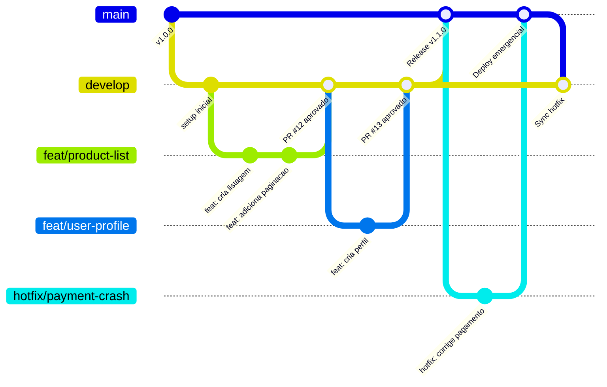
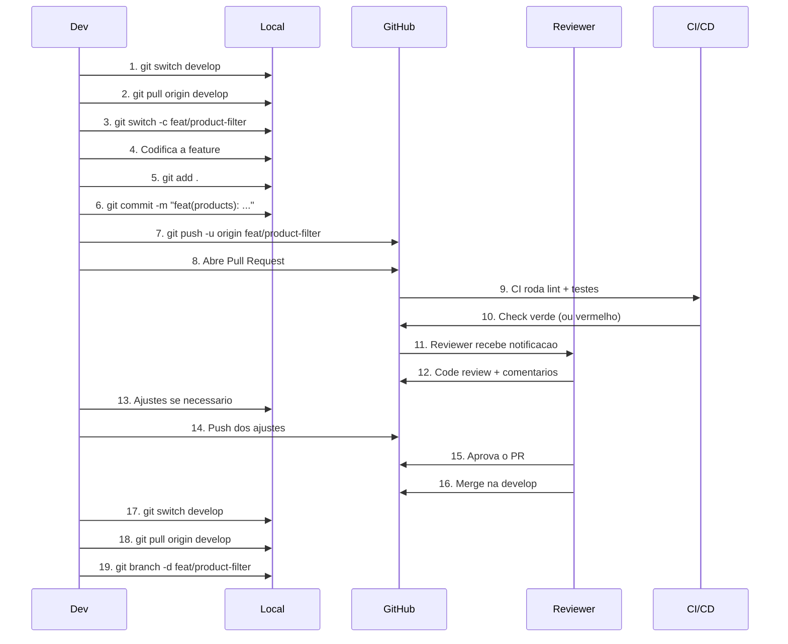

# 09 — Git Workflow

Como versionar codigo na Bravy. Se voce nunca usou Git, comece pelo inicio. Se ja usa, pule para a secao que precisa.

---

## 9.1 — O que e Git?

Imagine que voce esta escrevendo um documento importante. Voce salva como `proposta-v1.docx`, depois `proposta-v2-final.docx`, depois `proposta-v2-final-FINAL.docx`. Todo mundo ja fez isso.

**Git faz exatamente isso, mas de forma inteligente:**

| Sem Git | Com Git |
|---------|---------|
| `proposta-v1.docx` | `git commit -m "feat: cria proposta inicial"` |
| `proposta-v2-final.docx` | `git commit -m "feat: adiciona orcamento"` |
| `proposta-v2-final-FINAL.docx` | `git commit -m "fix: corrige valor do orcamento"` |
| Perde o historico | Historico completo de todas as mudancas |
| So voce tem o arquivo | Toda a equipe trabalha junto |
| Sem como voltar atras | Pode voltar para qualquer versao |

**Conceitos basicos:**

| Conceito | Analogia | O que e |
|----------|----------|---------|
| **Repository (repo)** | A pasta do projeto | O projeto inteiro com todo o historico |
| **Commit** | Um "save" do jogo | Um snapshot do codigo naquele momento |
| **Branch** | Uma copia paralela | Uma linha independente de desenvolvimento |
| **Merge** | Juntar dois documentos | Unir as mudancas de uma branch em outra |
| **Push** | Enviar por email | Enviar seus commits para o servidor |
| **Pull** | Baixar o email | Trazer as mudancas do servidor para sua maquina |
| **Clone** | Copiar uma pasta | Baixar o projeto pela primeira vez |

---

## 9.2 — 10 comandos essenciais que voce usa todo dia

### 1. `git clone` — Baixar um projeto

Usa quando: entrou na Bravy, comecou um projeto novo, precisa do codigo na sua maquina.

```bash
git clone https://github.com/bravy/bravy-marketplace-api.git
```

Resultado: cria a pasta `bravy-marketplace-api/` com todo o codigo e historico.

```bash
git clone https://github.com/bravy/bravy-marketplace-api.git meu-projeto
```

Resultado: mesma coisa, mas a pasta se chama `meu-projeto/`.

---

### 2. `git status` — Ver o que mudou

Usa quando: antes de qualquer commit, para saber o que esta acontecendo.

```bash
git status
```

Saida tipica:

```
On branch feat/product-list
Changes not staged for commit:
  modified:   src/modules/products/products.service.ts

Untracked files:
  src/modules/products/dto/filter-product.dto.ts
```

**Leitura rapida:**
- `modified` = voce editou esse arquivo
- `Untracked` = arquivo novo que o Git ainda nao conhece
- `staged` = pronto para commit

---

### 3. `git add` — Preparar arquivos para commit

Usa quando: voce quer escolher quais mudancas vao no proximo commit.

```bash
# Adicionar um arquivo especifico
git add src/modules/products/products.service.ts

# Adicionar todos os arquivos modificados
git add .

# Adicionar todos os arquivos de uma pasta
git add src/modules/products/
```

> **Regra Bravy:** prefira `git add .` apenas quando todas as mudancas fazem parte do mesmo commit logico. Se mexeu em coisas diferentes, adicione arquivo por arquivo.

---

### 4. `git commit` — Salvar um snapshot

Usa quando: terminou uma unidade logica de trabalho (uma funcao, uma correcao, um ajuste).

```bash
git commit -m "feat(products): adiciona filtro por categoria"
```

> **OBRIGATORIO:** seguir o padrao Conventional Commits (secao 9.4).

```bash
# Commit com descricao mais longa
git commit -m "feat(products): adiciona filtro por categoria

Implementa query parameter 'category' no endpoint GET /products.
Inclui validacao no DTO e teste unitario."
```

---

### 5. `git push` — Enviar para o servidor

Usa quando: quer que a equipe veja seu trabalho, quer abrir um PR, quer fazer backup.

```bash
# Primeira vez na branch (vincula local com remoto)
git push -u origin feat/product-list

# Demais vezes
git push
```

---

### 6. `git pull` — Trazer mudancas do servidor

Usa quando: comecou o dia de trabalho, antes de criar uma branch nova, alguem avisou que mergou algo.

```bash
git pull origin develop
```

> **Dica:** sempre faca `git pull` na `develop` antes de criar uma branch nova. Isso evita conflitos.

---

### 7. `git checkout` / `git switch` — Trocar de branch

Usa quando: precisa ir para outra branch, quer comecar uma feature nova.

```bash
# Trocar para uma branch existente
git switch develop
git checkout develop          # forma antiga, funciona igual

# Criar e trocar para uma branch nova
git switch -c feat/product-list
git checkout -b feat/product-list  # forma antiga
```

> **Recomendacao:** use `git switch` (mais moderno e claro). O `checkout` faz muitas coisas e pode confundir.

---

### 8. `git branch` — Gerenciar branches

Usa quando: quer ver quais branches existem, criar ou deletar uma branch.

```bash
# Listar branches locais
git branch

# Listar todas (locais + remotas)
git branch -a

# Deletar branch local ja mergeada
git branch -d feat/product-list

# Deletar branch local mesmo sem merge (cuidado!)
git branch -D feat/product-list
```

---

### 9. `git merge` — Unir branches

Usa quando: quer trazer as mudancas de uma branch para outra.

```bash
# Estando na develop, trazer as mudancas da feat/product-list
git switch develop
git merge feat/product-list
```

> **Na Bravy:** merges para `develop` e `main` sao feitos via Pull Request no GitHub, nunca localmente. Voce so usa merge local para atualizar sua branch com a develop.

```bash
# Atualizar sua branch com a develop (forma recomendada)
git switch feat/product-list
git merge develop
```

---

### 10. `git log` — Ver historico

Usa quando: quer ver o que aconteceu, quem fez o que, encontrar um commit especifico.

```bash
# Log resumido e bonito
git log --oneline --graph -20

# Log com mais detalhes
git log --pretty=format:"%h %an %ar %s" -10
```

Saida:

```
a1b2c3d feat(products): adiciona filtro por categoria
d4e5f6g fix(auth): corrige refresh token expirado
h7i8j9k chore: atualiza dependencias
```

---

## 9.3 — Branches

### Padrao de nomes

| Prefixo | Uso | Exemplo |
|---------|-----|---------|
| `main` | Producao. Codigo que esta no ar. | — |
| `develop` | Desenvolvimento. Base para novas features. | — |
| `feat/` | Nova funcionalidade | `feat/product-filter` |
| `fix/` | Correcao de bug | `fix/login-redirect-loop` |
| `hotfix/` | Correcao urgente em producao | `hotfix/payment-crash` |
| `chore/` | Manutencao (deps, configs, CI) | `chore/update-eslint` |
| `refactor/` | Refatoracao sem mudanca de comportamento | `refactor/product-service-cleanup` |

**Regras de nomenclatura:**
- Sempre em ingles
- Sempre kebab-case (`product-filter`, nao `productFilter`)
- Sempre descritivo (`feat/product-filter`, nao `feat/minha-feature`)
- Sem acentos, sem espacos, sem caracteres especiais

### Fluxo de branches



### Regras de protecao

| Branch | Quem pode dar merge | Requer PR | Requer aprovacao |
|--------|--------------------|-----------|--------------------|
| `main` | Lead / DevOps | Sim | Sim (minimo 1) |
| `develop` | Qualquer dev | Sim | Sim (minimo 1) |
| `feat/*`, `fix/*` | Autor da branch | Nao | Nao |

---

## 9.4 — Conventional Commits

**OBRIGATORIO em todos os projetos Bravy.**

### Formato

```
tipo(escopo): descricao curta

corpo opcional (explica o "por que")

footer opcional (breaking changes, issues)
```

### Tipos

| Tipo | Quando usar | Exemplo |
|------|------------|---------|
| `feat` | Nova funcionalidade para o usuario | `feat(products): adiciona busca por nome` |
| `fix` | Correcao de bug | `fix(auth): corrige loop infinito no refresh token` |
| `docs` | Documentacao | `docs(readme): adiciona instrucoes de setup` |
| `style` | Formatacao, ponto e virgula, espacos (sem mudanca de logica) | `style(products): ajusta indentacao do service` |
| `refactor` | Refatoracao (sem mudar comportamento externo) | `refactor(users): extrai validacao para helper` |
| `test` | Adicionar ou corrigir testes | `test(products): adiciona teste para filtro` |
| `chore` | Tarefas de manutencao | `chore: atualiza eslint para v9` |
| `perf` | Melhoria de performance | `perf(queries): adiciona indice na tabela products` |
| `ci` | Mudancas no CI/CD | `ci: adiciona step de lint no GitHub Actions` |
| `build` | Mudancas no build (webpack, docker, etc.) | `build: atualiza Dockerfile para multi-stage` |
| `revert` | Reverte um commit anterior | `revert: reverte feat(products): adiciona busca` |

### Exemplos reais

```bash
# Feature simples
git commit -m "feat(products): adiciona endpoint de listagem com paginacao"

# Bug fix
git commit -m "fix(auth): corrige token nao sendo renovado apos expirar"

# Refatoracao
git commit -m "refactor(users): move validacao de email para shared/validators"

# Teste
git commit -m "test(products): adiciona testes unitarios para ProductService.create"

# Chore
git commit -m "chore(deps): atualiza prisma de 5.10 para 5.12"

# Performance
git commit -m "perf(products): adiciona indice composto em (category_id, created_at)"

# CI
git commit -m "ci(github-actions): adiciona cache de node_modules no workflow"

# Docs
git commit -m "docs(api): documenta endpoint POST /products no Swagger"

# Build
git commit -m "build(docker): otimiza imagem com multi-stage build"

# Style
git commit -m "style: aplica prettier em todos os arquivos"

# Revert
git commit -m "revert: reverte feat(products): adiciona busca por nome

Revert do commit a1b2c3d. A busca por nome causou regressao na listagem."
```

### Breaking Changes

Quando uma mudanca quebra compatibilidade (ex: mudar formato de resposta da API):

```bash
git commit -m "feat(api)!: altera envelope de resposta para incluir pagination

BREAKING CHANGE: o campo 'meta' agora inclui 'pagination' com total, page e limit.
Clientes que consomem a API precisam atualizar o parser de resposta."
```

O `!` depois do escopo indica breaking change. O footer `BREAKING CHANGE:` detalha o impacto.

---

## 9.5 — Fluxo visual de uma feature

Do inicio ao fim, esse e o caminho que toda feature percorre:



### Passo a passo copiavel

```bash
# 1. Garante que esta na develop atualizada
git switch develop
git pull origin develop

# 2. Cria a branch da feature
git switch -c feat/product-filter

# 3. Faz os commits enquanto desenvolve
git add .
git commit -m "feat(products): adiciona filtro por categoria no endpoint GET"

git add .
git commit -m "feat(products): adiciona validacao no DTO de filtro"

git add .
git commit -m "test(products): adiciona testes para filtro por categoria"

# 4. Envia para o GitHub
git push -u origin feat/product-filter

# 5. Abre o PR no GitHub (ou via CLI)
gh pr create --base develop --title "feat(products): adiciona filtro por categoria" --body "## Descricao
Adiciona filtro por categoria no endpoint GET /products.

## Checklist
- [x] Testes unitarios
- [x] DTO validado
- [x] Documentacao Swagger"

# 6. Apos aprovacao e merge, limpa localmente
git switch develop
git pull origin develop
git branch -d feat/product-filter
```

---

## 9.6 — Template de PR

Copie e use em todo Pull Request:

```markdown
## Descricao

<!-- O que essa PR faz? Por que essa mudanca e necessaria? -->

## Tipo de mudanca

- [ ] Nova feature
- [ ] Correcao de bug
- [ ] Refatoracao
- [ ] Documentacao
- [ ] Hotfix
- [ ] Chore / manutencao

## Como testar

<!-- Passos para o reviewer testar suas mudancas -->

1. Checkout na branch `feat/...`
2. Rode `npm run dev`
3. Acesse `http://localhost:3000/...`
4. ...

## Checklist

- [ ] Segui o padrao de Conventional Commits
- [ ] Meu codigo segue os padroes de nomenclatura da Bravy
- [ ] Adicionei/atualizei testes
- [ ] Rodei `npm run lint` sem erros
- [ ] Rodei `npm run test` sem falhas
- [ ] Atualizei a documentacao (se aplicavel)
- [ ] Nao deixei `console.log` ou codigo de debug

## Screenshots / Gravacoes

<!-- Se for mudanca visual, cole prints ou GIFs aqui -->

| Antes | Depois |
|-------|--------|
| img   | img    |

## Observacoes

<!-- Algo que o reviewer precisa saber? Decisoes tecnicas? -->
```

---

## 9.7 — Code Review

### O que revisar

| Aspecto | O que olhar |
|---------|------------|
| **Funcionalidade** | Faz o que deveria? Cobre edge cases? |
| **Nomenclatura** | Segue o padrao Bravy ([03-nomenclatura](03-nomenclatura-e-padroes.md))? |
| **Seguranca** | Tem SQL injection? Dados sensiveis expostos? Falta autenticacao? |
| **Performance** | Query N+1? Loop desnecessario? Falta paginacao? |
| **Testes** | Tem testes? Cobrem o cenario feliz e os de erro? |
| **Legibilidade** | Outro dev entenderia esse codigo sem explicacao? |
| **Complexidade** | Da para simplificar? Funcao grande demais? |

### Como dar feedback (reviewer)

**Bom feedback:**
```
# Sugestao
A query em `findByCategory` pode causar N+1 se o produto tiver relacoes.
Sugiro usar `include` do Prisma aqui.

# Pergunta
Esse fallback para `null` e intencional? Se sim, vale documentar o motivo.

# Elogio
Gostei como voce separou a validacao em um helper reutilizavel.
```

**Feedback ruim:**
```
# Vago demais
"Isso esta errado"

# Agressivo
"Quem faz desse jeito?"

# Sem contexto
"Muda isso"
```

**Prefixos uteis nos comentarios:**

| Prefixo | Significado |
|---------|------------|
| `nit:` | Detalhe menor, nao bloqueia merge | 
| `suggestion:` | Sugestao de melhoria, aberto a discussao |
| `question:` | Pergunta genuina, quer entender |
| `blocker:` | Precisa corrigir antes de mergear |

### Como receber feedback (autor)

1. **Nao leve para o pessoal.** O review e sobre o codigo, nao sobre voce.
2. **Responda todos os comentarios.** Mesmo que seja "Feito!" ou "Concordo, ajustado".
3. **Se discorda, explique o motivo.** "Escolhi essa abordagem porque X. Faz sentido manter?"
4. **Agradeca sugestoes boas.** Cria um ambiente melhor para todo mundo.

---

## 9.8 — .gitignore padrao

Arquivo completo para o stack Bravy (NestJS + Next.js + Prisma + Docker):

```gitignore
# ========================================
# Dependencias
# ========================================
node_modules/
.pnp
.pnp.js

# ========================================
# Build / Output
# ========================================
dist/
build/
.next/
out/
*.tsbuildinfo

# ========================================
# Variaveis de ambiente
# ========================================
.env
.env.local
.env.development.local
.env.test.local
.env.production.local
.env*.local

# ========================================
# IDE / Editor
# ========================================
.vscode/settings.json
.idea/
*.swp
*.swo
*~
.DS_Store
Thumbs.db

# ========================================
# Logs
# ========================================
logs/
*.log
npm-debug.log*
yarn-debug.log*
yarn-error.log*
pnpm-debug.log*

# ========================================
# Testes
# ========================================
coverage/
.nyc_output/

# ========================================
# Docker (volumes locais)
# ========================================
docker-data/
pgdata/

# ========================================
# Prisma
# ========================================
prisma/*.db
prisma/*.db-journal

# ========================================
# OS
# ========================================
.DS_Store
Thumbs.db
ehthumbs.db
Desktop.ini

# ========================================
# Temporarios
# ========================================
tmp/
temp/
*.tmp
*.bak
*.cache
.turbo/
```

> **Onde colocar:** na raiz de cada repositorio (`bravy-{projeto}-api/.gitignore` e `bravy-{projeto}-web/.gitignore`).

---

## 9.9 — Comandos de emergencia

### Desfazer o ultimo commit (mantendo as mudancas)

Voce commitou mas nao era pra ter commitado ainda:

```bash
git reset --soft HEAD~1
```

As mudancas voltam para staging. Nada e perdido.

### Desfazer o ultimo commit (descartando as mudancas)

**Cuidado:** isso apaga as mudancas do commit.

```bash
git reset --hard HEAD~1
```

### Desfazer mudancas em um arquivo (antes do commit)

Editou um arquivo e quer voltar ao estado do ultimo commit:

```bash
git checkout -- src/modules/products/products.service.ts

# Forma moderna
git restore src/modules/products/products.service.ts
```

### Desfazer `git add` (tirar do staging)

Adicionou um arquivo por engano:

```bash
git reset HEAD src/modules/products/products.service.ts

# Forma moderna
git restore --staged src/modules/products/products.service.ts
```

### Resolver conflitos de merge

Quando o Git nao consegue juntar as mudancas automaticamente:

```bash
# 1. O merge para e mostra os conflitos
git merge develop
# CONFLICT in src/modules/products/products.service.ts

# 2. Abra o arquivo. Voce vera algo assim:
<<<<<<< HEAD
const limit = 10;
=======
const limit = 20;
>>>>>>> develop

# 3. Escolha a versao correta (ou combine as duas):
const limit = 20;

# 4. Remova os marcadores (<<<<, ====, >>>>)

# 5. Adicione e commite
git add src/modules/products/products.service.ts
git commit -m "fix: resolve conflito no limit de paginacao"
```

> **Dica:** o VS Code / Cursor tem uma interface visual para resolver conflitos. Use os botoes "Accept Current", "Accept Incoming" ou "Accept Both".

### Voltar para uma versao anterior (sem perder historico)

Voce quer desfazer um commit que ja foi pushado:

```bash
# Cria um novo commit que reverte as mudancas do commit especificado
git revert a1b2c3d
```

Diferente do `reset`, o `revert` cria um commit novo. Seguro para branches compartilhadas.

### Salvar mudancas temporariamente (stash)

Precisa trocar de branch mas tem mudancas nao commitadas:

```bash
# Salva as mudancas no stash
git stash

# Faz o que precisa em outra branch
git switch develop
git pull
git switch feat/product-filter

# Recupera as mudancas
git stash pop
```

### Ver o que mudou em um commit especifico

```bash
git show a1b2c3d
```

### Encontrar quem mexeu em uma linha

```bash
git blame src/modules/products/products.service.ts
```

### Tabela de emergencia rapida

| Situacao | Comando |
|----------|---------|
| Commitei errado (antes do push) | `git reset --soft HEAD~1` |
| Quero descartar tudo que fiz | `git reset --hard HEAD~1` |
| Adicionei arquivo errado no staging | `git restore --staged arquivo.ts` |
| Quero voltar um arquivo para como estava | `git restore arquivo.ts` |
| Preciso desfazer commit ja pushado | `git revert <hash>` |
| Preciso guardar mudancas temporariamente | `git stash` / `git stash pop` |
| Merge deu conflito | Editar arquivo > `git add` > `git commit` |
| Quero ver o que mudou | `git diff` |
| Quero ver historico resumido | `git log --oneline -20` |

---

## Proximos passos

- Precisa fazer deploy? -> [10-devops.md](10-devops.md)
- Precisa revisar seguranca? -> [11-seguranca.md](11-seguranca.md)
- Quer aprender a usar LLMs no desenvolvimento? -> [12-guia-vibecoding.md](12-guia-vibecoding.md)
- Voltar ao indice -> [00-indice.md](00-indice.md)
